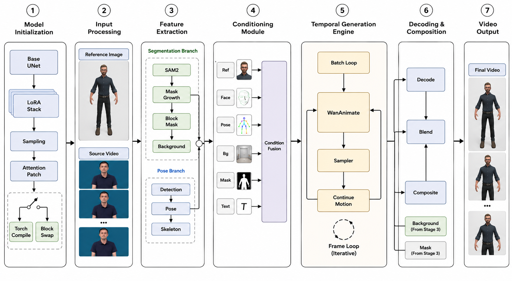

# An Approach to Sign Language Video Generation with Multimodal Generative Models

## Authors and Affiliations

**Tri-Tam La, Lam-Thu Le Huu, and Thai Truong**

College of Information and Communication Technology, Can Tho University, 3/2 Street, Can Tho City, 900000, Vietnam

## Abstract

Sign language serves as a crucial communication medium for deaf and hard-of-hearing individuals, enabling interaction with hearing communities. However, accessible sign language resources remain limited due to the lack of educational materials and technological support. To address this challenge, we investigate an approach to sign language video generation by adapting an open-source multi-stage generative AI framework. The framework integrates multimodal extraction of pose, facial and hand features, visual encoding, diffusion-based video synthesis, and video refinement to produce realistic sign language animations. By leveraging state-of-the-art video generation models and multimodal conditioning, the framework transfers motion and visual characteristics from reference inputs into synthesized sign language sequences. Its modular architecture further supports flexible extension to different sign language dialects and application scenarios. Experimental analysis demonstrates the feasibility of the framework for sign language content generation, providing an open and extensible foundation for AI-assisted communication, education, and accessibility applications.

## System Architecture



The pipeline processes a source video through four stages:

1. **Input & Segmentation** — Source video is loaded and the target character is isolated using SAM2 segmentation with optional manual point editing.
2. **Pose & Face Extraction** — Pose skeletons (ViTPose + YOLO) and face regions are extracted per frame from the source video.
3. **Animation Generation** — A reference character image is animated via WanAnimateToVideo, conditioned on the extracted pose, face, background, and character mask from the source video.
4. **Output** — The generated frames are composited and saved with the original audio.

## Project Structure

```
├── Original/       # Source input videos
├── After/          # Generated/output videos
├── Skeleton/       # Extracted pose skeleton visualizations
├── Model/          # Reference character images (male/female)
├── assets/         # Diagrams and resources
└── FrameWork.json  # ComfyUI workflow definition
```

## Results

Example inputs and corresponding outputs are provided in the `Original/` and `After/` directories, covering diverse Vietnamese sign language gestures (greeting, sharing, food, sky, ocean, etc.). Pose skeleton previews are available in `Skeleton/`.

## Citation
