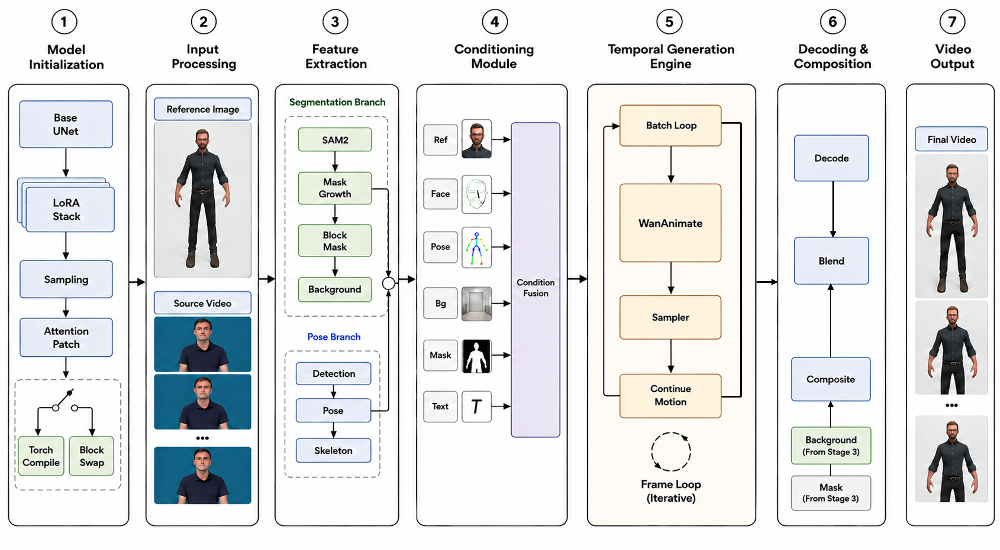

# An Approach to Sign Language Video Generation with Multimodal Generative Models

## Authors and Affiliations

**Tri-Tam La, Lam-Thu Le Huu, and Minh-Thai Truong**

College of Information and Communication Technology, Can Tho University, 3/2 Street, Can Tho City, 900000, Vietnam

## Abstract

Sign language serves as a crucial communication medium for deaf and hard-of-hearing individuals, enabling interaction with hearing communities. However, accessible sign language resources remain limited due to the lack of educational materials and technological support. To address this challenge, we investigate an approach to sign language video generation by adapting an open-source multi-stage generative AI framework. The framework integrates multimodal extraction of pose, facial and hand features, visual encoding, diffusion-based video synthesis, and video refinement to produce realistic sign language animations. By leveraging state-of-the-art video generation models and multimodal conditioning, the framework transfers motion and visual characteristics from reference inputs into synthesized sign language sequences. Its modular architecture further supports flexible extension to different sign language dialects and application scenarios. Experimental analysis demonstrates the feasibility of the framework for sign language content generation, providing an open and extensible foundation for AI-assisted communication, education, and accessibility applications.

## System Architecture



The pipeline processes a source video through four stages:

1. **Input & Segmentation** — Source video is loaded and the target character is isolated using SAM2 segmentation with optional manual point editing.
2. **Pose & Face Extraction** — Pose skeletons (ViTPose + YOLO) and face regions are extracted per frame from the source video.
3. **Animation Generation** — A reference character image is animated via WanAnimateToVideo, conditioned on the extracted pose, face, background, and character mask from the source video.
4. **Output** — The generated frames are composited and saved with the original audio.

## Project Structure

```
├── Animate/                  # Generated/output videos
├── Model/                    # Reference character images (male/female)
├── assets/                   # Diagrams and resources
├── Framework.json            # ComfyUI generation workflow (pure animation, no evaluation nodes)
├── custom_nodes/             # ComfyUI extensions (PA-MPJPE, PA-PCK, FVD)
├── src/                      # Evaluation microservice & clients
│   ├── api.py                # Flask service & background queue worker
│   ├── comfy_client.py       # ComfyUI HTTP/WS API client
│   └── dataset_manager.py    # Kaggle dataset manager & on-demand downloader
├── scripts/                  # Standalone benchmarking & verification scripts
│   ├── evaluate_benchmark.py # Standalone evaluation (FVD, PA-MPJPE, PA-PCK) without ComfyUI
│   └── finalize_metrics.py   # Finalized benchmark reporting script
```

## Evaluation Microservice

A production-grade Flask microservice in `src/api.py` connects to an external ComfyUI server to synthesize sign language animations on-demand from the Kaggle Vietnamese Sign Language dataset (`aresusayhi/vsl-vietnamese-sign-languages`) and compute FVD and ViTPose wholebody kinematics.

### Running the Microservice

```bash
uv run python -m src.api
```

**Environment Variables:**
- `COMFYUI_HOST`: Remote ComfyUI endpoint (default: `http://127.0.0.1:8188`)
- `FLASK_HOST`: Bind address (default: `0.0.0.0`)
- `FLASK_PORT`: Service port (default: `5000`)

### Endpoints

- `GET /api/v1/health`: Microservice health and ComfyUI server connectivity.
- `GET /api/v1/dataset/info`: Dataset statistics and local cached samples count.
- `GET /api/v1/dataset/search?q=<query>&limit=20`: Search sign language labels and video names.
- `POST /api/v1/evaluate/sample`: Asynchronously sample $N$ videos deterministically with seed, synthesize via ComfyUI, and compute metrics.
- `POST /api/v1/evaluate/video`: Evaluate a specific video file.
- `GET /api/v1/jobs/<job_id>`: Check job status, real-time stage, and final evaluation results.
- `GET /api/v1/jobs`: List recent evaluation jobs.

## Results

Example inputs and corresponding outputs are provided in the `Original/` and `After/` directories, covering diverse Vietnamese sign language gestures (greeting, sharing, food, sky, ocean, etc.).

## Citation
